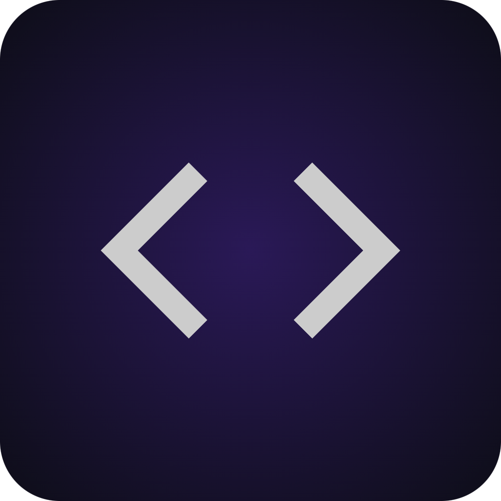
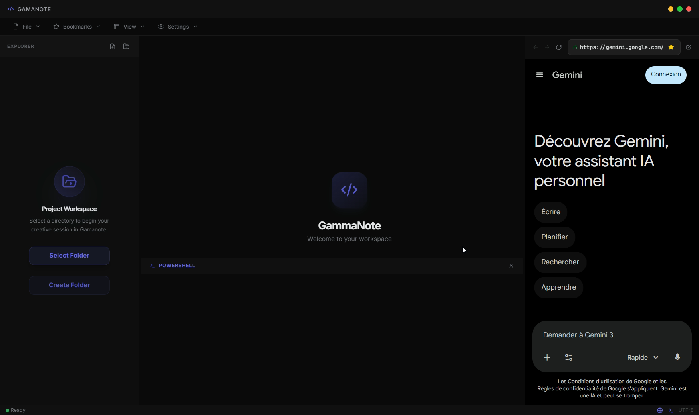
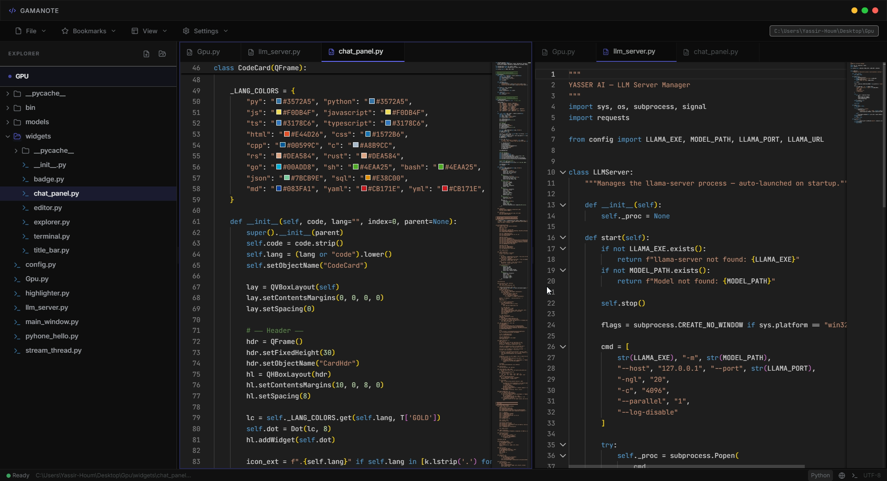
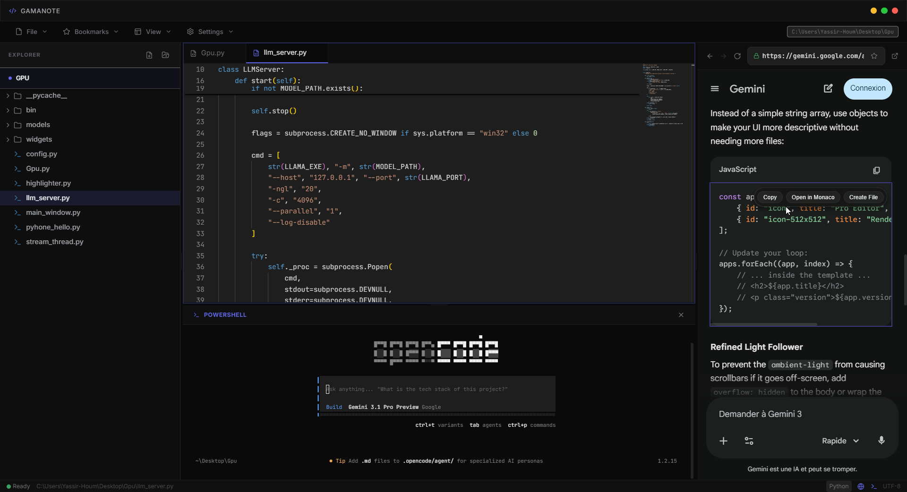
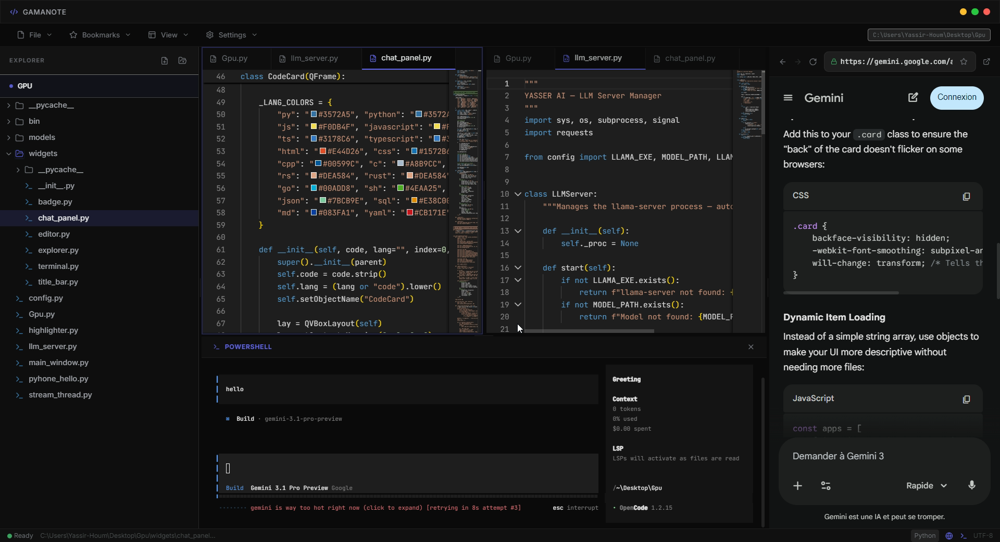

#  Gamanote

[](#)
[](#)
## 📝 Description
> **Gamanote** is  modern desktop IDE and note-taking application built with Electron, React, and Vite. It aims to provide a seamless development experience with integrated tools and a sleek user interface.

- **Frontend**: [React](https://reactjs.org/), [Vite](https://vitejs.dev/)
- **Desktop**: [Electron](https://www.electronjs.org/)
- **Styling**: [TailwindCSS](https://tailwindcss.com/)
- **State Management**: [Zustand](https://github.com/pmndrs/zustand)
- **Editor**: [@monaco-editor/react](https://github.com/suren-atoyan/monaco-react)
- **Terminal**: [xterm.js](https://xtermjs.org/)

<p align="center">
  
</p>

## Screenshots
| Preview 1 | Preview 2 |
|---|---|
|  |  |
|  |  |

---


---
## video 

### ✨ Key Features


- **Monaco Editor**: Powerful code editing .
- **Integrated Terminal**: Full-featured terminal with Windows/Unix support (using `node-pty`).
- **File Explorer**: Intuitive file system management with multi-selection support.
- **Git Integration**: Built-in Git tools for version control management.
- **Embedded Browser**: Preview web projects or browse documentation within the IDE.
- **Modern UI**: Smooth animations with `framer-motion` and responsive layout with `react-resizable-panels`.
- **Customizable**: Tailored for both dark mode and high performance.

## Install 
```bash
npm install
npm run dev
```

## Clone 

   ```bash
   git clone https://github.com/yasser27/gamanote.git
   ```


